# :boom: AmneziaWG + MikroTik :boom:


В данном репозитории рассматривается работа MikroTik RouterOS V7.16.2+ с проектом [Amnezia WG](https://docs.amnezia.org/ru/documentation/amnezia-wg/). В процессе настройки, относительно вашего оборудования, следует выбрать вариант реализации с [контейнером](https://help.mikrotik.com/docs/display/ROS/Container) внутри RouterOS или без контейнера. 

:school: Внимание! Инструкция среднего уровня сложности. Перед применением настроек вам необходимо иметь опыт в настройке MikroTik уровня сертификации MTCNA. 

В репозитории присутствуют готовые контейнеры Docker в каталоге **"Images"** которые можно сразу использовать внутри RouterOS. Контейнеры делятся на три архитектуры **ARM, ARM64 и x86**. Под каждую архитектуру собрано два контейнера с NAT и без NAT. Он нам нужен что бы использовать правило masquerade при передаче трафика через контейнер. Если настраивается прозрачная маршрутизация, NAT не обязателен.

:point_right: Особенности контейнеров с NAT:
1) Не требуют дополнительной настройки на стороне сервера VPS. 
2) Более тяжеловесны. Может быть критично для некоторых устройств MikroTik с маленькой внутренней памятью.

:point_right: Особенности контейнеров без NAT:
1) Требуют [дополнительной](#MikroTik_container_3) настройки на стороне сервера VPS
2) Более лёгкие по объёму 

Вариант №2 без контейнера подойдёт к любому домашнему роутеру который хоть немного умеет работать с аналогичными в MikroTik адрес-листами или имеет расширенный функционал по маршрутизации.

------------

* [Преднастройка RouterOS](#Pre_edit)
* [Вариант №1. RouterOS с контейнером](#R_AWG)
	- [Сборка контейнера на Windows](#MikroTik_container_1)
	- [Готовые контейнеры](#Build_ready)
	- [Настройка контейнера в RouterOS](#MikroTik_container_2)
	- [Настройка серверной части для контейнеров без NAT](#MikroTik_container_3)
* [Вариант №2. RouterOS без контейнера](#RLA)
	- [Установка Debian Linux](#MikroTik_linux_1)
	- [Установка xrdp](#MikroTik_linux_2)
	- [Включение маршрутизации в Linux](#MikroTik_linux_3)
	- [Установка клиента AmneziaVPN](#MikroTik_linux_4)
	- [Настройка IPtables](#MikroTik_linux_5)
	- [Автовход xfce](#MikroTik_linux_6)
	- [Настройка роутера](#MikroTik_linux_7)
	

------------

<a name='Pre_edit'></a>
## Преднастройка RouterOS

Создадим отдельную таблицу маршрутизации:
```
/routing table 
add disabled=no fib name=r_to_vpn
```
Добавим address-list "to_vpn" что бы находившиеся в нём IP адреса и подсети заворачивать в пока ещё не созданный туннель
```
/ip firewall address-list
add address=8.8.4.4 list=to_vpn
```
Добавим address-list "RFC1918" что бы не потерять доступ до RouterOS при дальнейшей настройке
```
/ip firewall address-list
add address=10.0.0.0/8 list=RFC1918
add address=172.16.0.0/12 list=RFC1918
add address=192.168.0.0/16 list=RFC1918
```


Добавим правила в mangle для address-list "RFC1918" и переместим его в самый верх правил
```
/ip firewall mangle
add action=accept chain=prerouting dst-address-list=RFC1918 in-interface-list=!WAN
```

Добавим правило транзитного трафика в mangle для address-list "to_vpn"
```
/ip firewall mangle
add action=mark-connection chain=prerouting connection-mark=no-mark dst-address-list=to_vpn in-interface-list=!WAN \
    new-connection-mark=to-vpn-conn passthrough=yes
```
Добавим правило для транзитного трафика отправляющее искать маршрут до узла назначения через таблицу маршрутизации "r_to_vpn", созданную на первом шаге
```
add action=mark-routing chain=prerouting connection-mark=to-vpn-conn in-interface-list=!WAN new-routing-mark=r_to_vpn \
    passthrough=yes
```
Маршрут по умолчанию в созданную таблицу маршрутизации "r_to_vpn" добавим чуть позже.

:exclamation:Два выше обозначенных правила будут работать только для трафика, проходящего через маршрутизатор. 
Если вы хотите заворачивать трафик, генерируемый самим роутером (например команда ping 8.8.4.4 c роутера для проверки туннеля в контейнере), тогда добавляем ещё два правила (не обязательно). 
Они должны находиться по порядку, следуя за выше обозначенными правилами.
```
/ip firewall mangle
add action=mark-connection chain=output connection-mark=no-mark \
    dst-address-list=to_vpn new-connection-mark=to-vpn-conn-local \
    passthrough=yes
add action=mark-routing chain=output connection-mark=to-vpn-conn-local \
    new-routing-mark=r_to_vpn passthrough=yes
```


------------
<a name='R_AWG'></a>
<a name='MikroTik_container_1'></a>
## Вариант №1. RouterOS с контейнером

### Сборка контейнера на Windows

Данный пункт настройки подходит только для устройств с архитектурой **ARM, ARM64 или x86**. Перед запуском контейнера в RouteOS убедитесь что у вас [включены контейнеры](https://help.mikrotik.com/docs/display/ROS/Container).  С полным списком устройств можно ознакомится [тут](https://mikrotik.com/products/matrix). [Включаем поддержку контейнеров в RouterOS](https://www.google.com/search?q=%D0%9A%D0%B0%D0%BA+%D0%B2%D0%BA%D0%BB%D1%8E%D1%87%D0%B8%D1%82%D1%8C+%D0%BA%D0%BE%D0%BD%D1%82%D0%B5%D0%B9%D0%BD%D0%B5%D1%80%D1%8B+%D0%B2+mikrotik&oq=%D0%BA%D0%B0%D0%BA+%D0%B2%D0%BA%D0%BB%D1%8E%D1%87%D0%B8%D1%82%D1%8C+%D0%BA%D0%BE%D0%BD%D1%82%D0%B5%D0%B9%D0%BD%D0%B5%D1%80%D1%8B+%D0%B2+mikrotik).
Так же предполагается что на устройстве (или если есть USB порт с флешкой) имеется +- 70 Мбайт свободного места для разворачивания контейнера внутри RouterOS. Если места не хватает, его можно временно расширить [за счёт оперативной памяти](https://www.youtube.com/watch?v=uZKTqRtXu4M). После перезагрузки RouterOS, всё что находится в RAM, стирается. 

<a name='#Build_ready'></a>
**Где взять контейнер?** Его можно собрать самому из текущего репозитория каталога **"Containers"** или скачать готовый образ под выбранную архитектуру из каталога **"Images"**.
Скачав готовый образ [переходим сразу к настройке](#MikroTik_container_2).


Для самостоятельной сборки следует установить подсистему Docker [buildx](https://github.com/docker/buildx?tab=readme-ov-file), "make" и "go".

В текущем примере будем собирать на Windows:
1) Скачиваем [Docker Desktop](https://docs.docker.com/desktop/) и устанавливаем
2) Скачиваем нужный архив с NAT или без NAT (различия описаны в начале статьи) для сборки из каталога **"Containers"** под вашу архитектуру RouterOS.
3) Распаковываем архив
3) Открываем CMD и переходим в распакованный каталог (cd <путь до каталога>)
4) Запускаем Docker с ярлыка на рабочем столе (окно приложения должно просто висеть в фоне при сборке) и через cmd собираем контейнер под выбранную архитектуру RouterOS

- ARMv7 (arm/v7) — спецификация 7-го поколения оборудования ARM, которое поддерживает только архитектуру AArch32. 
- ARMv8 (arm64/v8) — спецификация 8-го поколения оборудования ARM, которое поддерживает архитектуры AArch32 и AArch64.
- AMD64 (amd64) — это 64-битный процессор, который добавляет возможности 64-битных вычислений к архитектуре x86

Для ARMv8 (Containers\amnezia-wg-docker-master-arm64.tar)
```
docker buildx build --build-arg ARCHITECTURE=arm64 --no-cache --progress=plain --platform linux/arm64/v8 --output=type=docker --tag docker-awg:latest . && docker save docker-awg:latest > docker-awg.tar
```

Для ARMv7 (Containers\amnezia-wg-docker-master-arm.tar)
```
docker buildx build --build-arg ARCHITECTURE=arm --no-cache --progress=plain --platform linux/arm/v7 --output=type=docker --tag docker-awg:latest . && docker save docker-awg:latest > docker-awg.tar
```

Для amd64 (Containers\amnezia-wg-docker-master-amd64.tar)
```
docker buildx build --build-arg ARCHITECTURE=amd64 --no-cache --progress=plain --platform linux/amd64 --output=type=docker --tag docker-awg:latest . && docker save docker-awg:latest > docker-awg.tar
```
Иногда процесс создания образа может подвиснуть из-за плохого соединения с интернетом. Следует повторно запустить сборку. 
После окончания сборки, необходимо загрузить появившийся архив "docker-awg.tar" в корень на RouterOS. 


<a name='MikroTik_container_2'></a>
### Настройка контейнера в RouterOS

В текущем примере на устройстве MikroTik флешки нет. Хранить будем всё в корне.
Если у вас есть USB порт и флешка, лучше размещать контейнер на ней. 

:exclamation:**Если контейнер не запускается на флешке.**
Например, вы хотите разместить контейнер в каталоге /usb1/docker/awg. Не создавайте заранее каталог awg на USB-флеш-накопителе. При создании контейнера добавьте в команду распаковки параметр "root-dir=usb1/docker/awg", в этом случае контейнер распакуется самостоятельно создав каталог /usb1/docker/awg и запустится без проблем.

**Перемещаем собранный или готовый контейнер на диск устройства.**
В текущем примере название контейнера будет "docker-awg.tar". 
Если вы скачали готовый контейнер из каталога **"Images"**, переименуйте его в "docker-awg.tar" для применения нижеследующих команд.

В RouterOS выполняем:
1) Создадим интерфейс для контейнера
```
/interface veth
add address=172.18.20.2/30 gateway=172.18.20.1 gateway6="" name=docker-awg-veth
```

2) Добавим правило в mangle для изменения mss для трафика, уходящего в контейнер. Поместите его после правила с RFC1918 (его мы создали ранее).
```
/ip firewall mangle
add action=change-mss chain=forward new-mss=1360 out-interface=docker-awg-veth passthrough=yes protocol=tcp tcp-flags=syn tcp-mss=1453-6553
```

3) Назначим на созданный интерфейс IP адрес. IP 172.18.20.2 возьмёт себе контейнер, а 172.18.20.1 будет адрес RouterOS.
```
/ip address
add interface=docker-awg-veth address=172.18.20.1/30
```
4) В таблице маршрутизации "r_to_vpn" создадим маршрут по умолчанию ведущий на контейнер
```
/ip route
add distance=1 dst-address=0.0.0.0/0 gateway=172.18.20.2 routing-table=r_to_vpn
```
5) Включаем masquerade для всего трафика, уходящего в контейнер.
```
/ip firewall nat
add action=masquerade chain=srcnat out-interface=docker-awg-veth
```
6) Создадим каталог в корне "wg"
```
/file add type=directory name=wg
```
Поместите в данный каталог файл подключения клиента к серверу AWG. В примере это файл awg0.conf, текстовую конфигурацию для которого, сформировало приложение AmneziaVPN. (Копируем настройки Amnezia WireGuard из приложения в виде текста и вставляем в файл awg0.conf).
Не используйте автоматически сформированный маршрут по умолчанию (0.0.0.0/0) в разделе конфигурации клиента [Peer] => AllowedIPs. Для расчёта разрешённых подсетей, отправляемых в туннель, используйте [WireGuard калькулятор](https://www.procustodibus.com/blog/2021/03/wireguard-allowedips-calculator/). 
В качестве разрешённых сетей нужно прописать маршрут "0.0.0.0/0" и в исключения добавить три сети:

- 172.18.20.0/30 (сеть связующая роутер и контейнер из текущего примера)
- 123.123.123.123/32 (адрес из поля [Peer] => Endpoint в конфигурации клиента AWG. Фактически это адрес куда будет подключаться наш контейнер с AWG)
- 10.8.1.*/32 (сеть из поля [Interface] => Address в конфигурации клиента AWG)

Полученный результат из калькулятора вставляем в [Peer] => AllowedIPs конфигурации клиента AWG.
Должно получиться примерно так

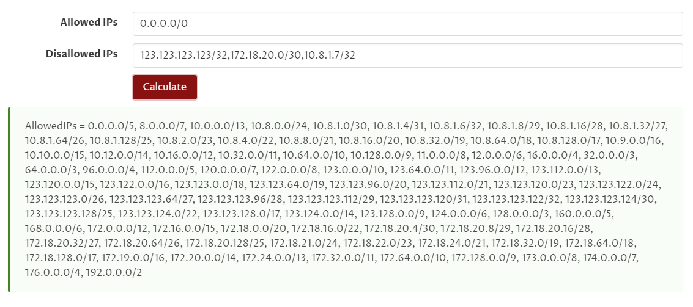

7) Создадим каталог в корне "tmp". Для временных файлов контейнера.
```
/file add type=directory name=tmp
```
8) Создадим запись "mounts" для проброса файла конфигурации клиента AWG в контейнер
```
/container mounts
add dst=/etc/amnezia/amneziawg/ name=awg_conf src=/wg
```
9) Теперь создадим сам контейнер
```
/container config
set tmpdir=tmp

/container
add hostname=amnezia interface=docker-awg-veth logging=yes start-on-boot=yes mounts=awg_conf file=docker-awg.tar 
```
Подождите немного пока контейнер распакуется до конца и файл "docker-awg.tar" можно удалить. В итоге у вас должна получиться похожая картина, в которой есть распакованный контейнер и файл конфигурации AWG.

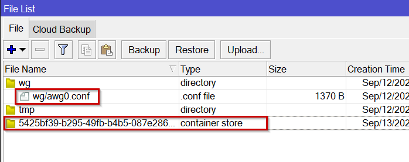

10) Запускаем контейнер через WinBox в разделе меню "container" и проверяем что туннель у нас поднялся. В логах MikroTik вы увидите характерные сообщения о запуске контейнера. 
В окне терминала подключаемся к консоли самого контейнера
```
/container shell 0
```
11) **Проверка! Убедитесь что у вас появился поднятый интерфейс awg0 выполнив в контейнере**
```
ip a
```
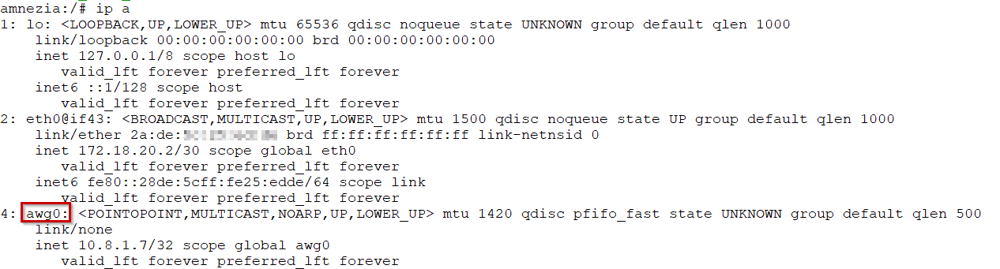

Если интерфейс появился, можно сделать трассировку и убедиться, что сетевой пакет ушёл в туннель AWG. Если на первом хопе вы увидели адрес 172.18.20.1 значит настройка файла конфигурации клиента с [WireGuard калькулятором ](https://www.procustodibus.com/blog/2021/03/wireguard-allowedips-calculator/)произведена неверно.

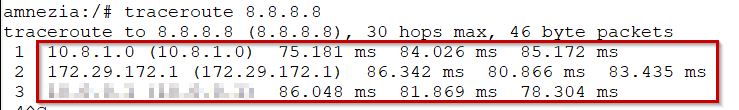


**Для контейнеров с NAT:**
 :fire::fire::fire: Поздравляю! Настройка для вас завершена. Можно проверить доступность IP 8.8.4.4 из списка "to_vpn" (этот адрес мы добавили ранее).
 
**Для контейнеров без NAT:**
Теперь сетевые пакеты которые вы отправляете с рабочего места или с RouterOS на 8.8.4.4 (этот адрес ранее мы добавили в адрес-лист "to_vpn") будут проходить правило masquerade и заворачиваться на контейнер.
Наши сетевые пакеты доходят до адреса назначения 8.8.4.4 и возвращаются до сервера AmneziaVPN, но дальше в туннель на наш контейнер в MikroTik уже не вернутся. 
Тут дело в том, что сервер AmneziaVPN, запущенный так же в контейнере на удалённом VPS и к которому происходит подключение через AWG туннель, 
знает что к нему подключился клиент с определённым IP адресом из сети 10.8.1.0/24, но ничего не знает про сеть 172.18.20.0/30, связующую наш роутер и контейнер. 
Добавим её на стороне сервера в следующем разделе.

<a name='MikroTik_container_3'></a>
## Настройка серверной части AmneziaWG для контейнеров без NAT

Предполагается что вы уже установили VPS сервер с AmneziaVPN и настроили протокол AmneziaWG через приложение. 
Каждый протокол VPN запускается в своём контейнере. Нам остаётся найти его.
Подключаемся к VPS серверу и ищем название нашего контейнера. 
```
docker ps -a
```
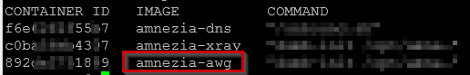

Подключаемся к его shell
```
docker exec -it amnezia-awg bash
```
Определяем название интерфейса AWG через ``` ip a ``` или посмотрев содержимое каталога через ``` ls -l /opt/amnezia/awg/```.
У вас интерфейс AWG может быть с другим названием.

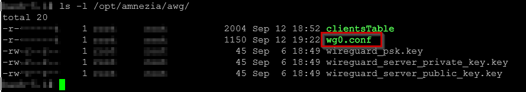

Временно гасим интерфейс wg0 и всю его конфигурацию. 
```
wg-quick down /opt/amnezia/awg/wg0.conf
```
Открываем конфиг через текстовый редактор Vim (к сожалению других в контейнере нет) [Заранее попрактикуйтесь](https://www.google.com/search?q=vim+%D0%BA%D0%BE%D0%BC%D0%B0%D0%BD%D0%B4%D1%8B) как редактировать текст, сохранять и выходить из редактора. 
```
vi /opt/amnezia/awg/wg0.conf
```
Находим [Peer] нашего клиента (фактически он будет таким же как и в конфиге клиента в разделе [Interface]) по выданному адресу и добавляем нашу сеть 172.18.20.0/30 к AllowedIPs. 
Должно получиться так:

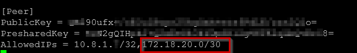

Открываем скрипт где хранятся правила IPtables
```
vi /opt/amnezia/start.sh
```

Изменяем существующие правила MASQUERADE или добавляем свои по аналогии в конец списка
```
iptables -t nat -A POSTROUTING -o eth0 -j MASQUERADE
iptables -t nat -A POSTROUTING -o eth1 -j MASQUERADE
```
Должно получиться так:

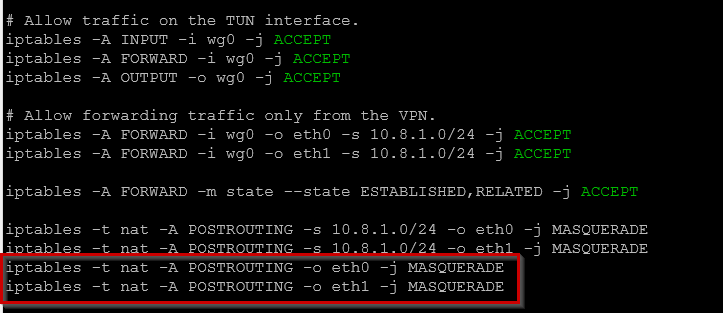

В конце просто запускаем конфиг и выходим из контейнера. 
```
wg-quick up /opt/amnezia/awg/wg0.conf
exit 
exit 
```

:fire::fire::fire:  **Поздравляю! Настройка завершена. Можно проверить доступность IP 8.8.4.4 из списка "to_vpn" (этот адрес мы добавили ранее).**

Что мы получили в итоге? Прозрачную маршрутизацию до контейнера AmneziaWG на стороне сервера. 
RouterOS отправляет помеченные соединения в контейнер=>контейнер заворачивает трафик в туннель AWG=>Контейнер AWG на стороне VPS сервера получая пакет.
Благодаря нашему обратному маршруту 172.18.20.0/30 сервер будет знать куда ему отправлять пакеты в обратную сторону=> далее пакет проходит правила NAT и выходит в интернет.

PS. В контейнере есть "cat" для быстрого просмотра содержимого файлов, "top" для ознакомления с запущенными процессами. 
Так же можно безболезненно перезагружать сервер VPS, добавлять или удалять других пользователей AWG. 

------------
<a name='RLA'></a>
## Вариант №2. RouterOS без контейнера

Не известно введут ли разработчики MikroTik возможность нативной интеграции с AmneziaVPN. 
Вполне вероятно, что этого может не произойти. Если вам не повезло и ваш MikroTik не поддерживает контейнеры, не расстраивайтесь. 
Есть вполне рабочее решение, подходящее большинству роутеров (не только MikroTik). 
Нам нужен [дополнительный мини ПК](https://www.google.com/search?q=%D0%BC%D0%B8%D0%BD%D0%B8+%D0%BF%D0%BA+%D0%B4%D0%BB%D1%8F+linux) с одним сетевым портом и возможностью установить на него [Debian Linux](https://www.debian.org/).
Идея заключается в единоразовой настройке Debian с помощью экрана монитора с клавиатурой и последующее удалённое управление без необходимости подключения периферийных устройств.  

<a name='MikroTik_linux_1'></a>
### Установка Debian Linux

Предполагается, что вы сможете самостоятельно установить Debian на мини ПК через GUI с редактированием некоторых значений в процессе установки, подключением кабеля ethernet к локальной сети вашего роутера.
В настройках BIOS мини ПК желательно сделать автозапуск системы при появлении питания.
Установка Debian Linux потребуется в самой минимальной конфигурации

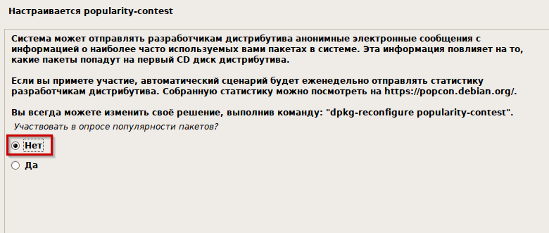

На этапе выбора программного обеспечения устанавливаем Xfce (более стабилен при подключении через RDP), SSH сервер и стандартные системные утилиты. 

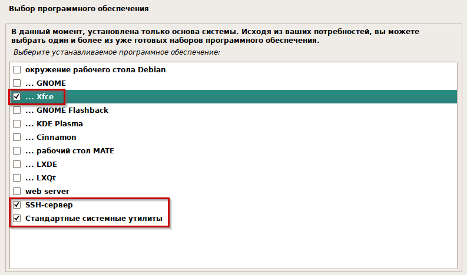

Дальнейшие действия можно сделать подключившись через SSH к мини ПК.

Дадим root доступ для нашего пользователя (у вас он может быть другим)

```
su -
sudo usermod -aG sudo root-home
```

P.S. По вкусу можно установить ```apt install mc htop -y```

<a name='MikroTik_linux_2'></a>
### Установка xrdp

Для удалённого управления клиентом AmneziaVPN нам понадобится RDP

```
apt-get update
apt-get install xrdp -y
systemctl enable xrdp
systemctl start xrdp
```

<a name='MikroTik_linux_3'></a>
### Включение маршрутизации в Linux

Маршрутизация нам необходима, так-как нужно передавать пакеты от роутера через Debian в туннель клиента AmneziaVPN.
Фактически наш Debian будет ещё одним роутером.

Открываем файл
```
nano /etc/sysctl.conf
```

Ищем строку ```net.ipv4.ip_forward=```, раскомментируем и приводим к виду ```net.ipv4.ip_forward=1```. Сохраняем файл и перезагружаемся. 
Проверяем результат выполнив

```
sysctl net.ipv4.ip_forward
```

Должен получиться вывод ```net.ipv4.ip_forward = 1```

<a name='MikroTik_linux_4'></a>
### Установка клиента AmneziaVPN

Подключаемся через RDP к мини ПК и устанавливаем AmneziaVPN, заранее переместив скачанный "AmneziaVPN_Linux_Installer.bin" в Debian. Переходим в каталог с файлом.

В текущем примере файл лежит в каталоге ```/opt/amneziavpn```

Открываем терминал внутри RDP сессии и выполняем

```
cd /opt/amneziavpn
sudo chmod u+x AmneziaVPN_Linux_Installer.bin
sudo apt-get install libxcb-icccm4 libfontconfig1 libxcb-glx0 libx11-xcb1 libxcb-image0 libxcb-keysyms1 libxcb-randr0 libxcb-render-util0 libxcb-shape0 libxcb-sync1 libxcb-xfixes0 libxcb-xinerama0 libxcb-xkb1 libxkbcommon-x11-0 libgl1 -y
./AmneziaVPN_Linux_Installer.bin
```

После появления окна приложения AmneziaVPN делаем стандартную процедуру установки. В результате вы должны получить установленное приложение

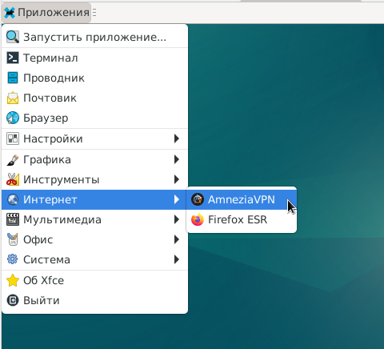

Вставляем сформированный конфиг AmneziaWireGuard или OpenVPN в приложение. Включаем автозапуск при входе пользователя и автоподключение. 

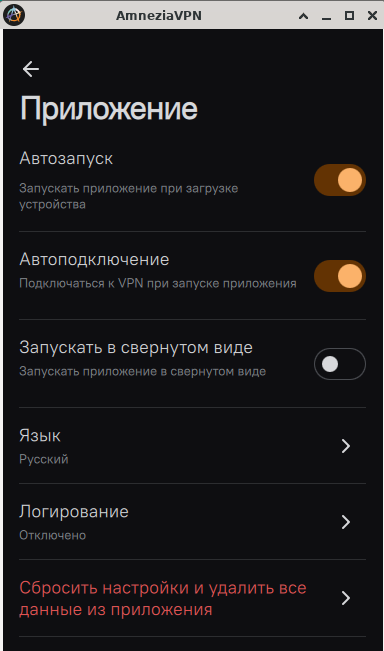

<a name='MikroTik_linux_5'></a>
### Настройка IPtables

Весь трафик, отправляемый в туннель, нужно провести через правило NAT MASQUERADE иначе удаённый сервер не будет знать куда отправлять трафик в обратную сторону.

Установим IPtables. На все сообщения в процессе установки отвечаем "ДА"
```
sudo apt install iptables-persistent iptables -y
```

Теперь нам нужно определиться с названием интерфейса, который создаст клиент AmneziaVPN. 
**В текущем примере мы будем подключатсья через протокол AWG. При использовании OpenVPN имя интерфейса может быть другим.**
Подключаемся к VPN и смотрим название интерфейса в выводе ```ip a```

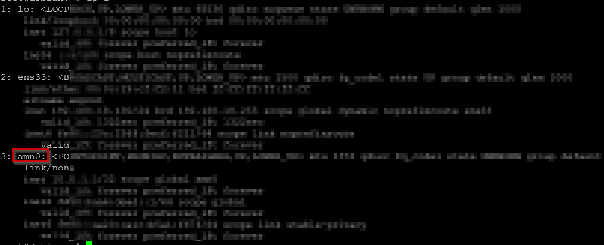

Включаем MASQUERADE для данного интерфейса и сохраняемся, что бы после перезагрузки правила не удалились. 

```
iptables -t nat -A POSTROUTING -o amn0 -j MASQUERADE
iptables-save
iptables-save > /etc/iptables/rules.v4
ip6tables-save > /etc/iptables/rules.v6
```

Перезагружаемся и смотрим результат
```
iptables -t nat -L -n -v
```

В цепочке "Chain POSTROUTING" должно присутствовать наше правило:

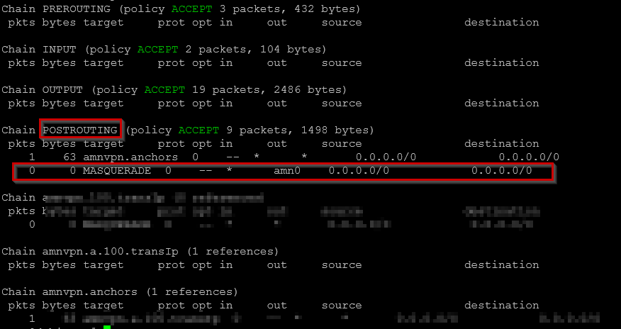

<a name='MikroTik_linux_6'></a>
### Автовход xfce

Для того чтобы включить автоматический вход в систему на debian, необходимо отредактировать файл ```/etc/gdm3/daemon.conf```. 
Авторизуемся и входим под root ```su -```
Можно воспользоваться текстовым редактором nano :

```
sudo nano /etc/lightdm/lightdm.conf 
```

Ищем следующие строки, скорее всего они будут у Вас закомментированы

```
[Seat:*]
#autologin-user=
```

Приводим строку к виду. У вас пользователь может быть другим.

```
autologin-user=root-home
```

Перезагружаемся и смотрим результат. У нас срабатывает автологон, автозапуск клиента AmneziaVPN и автоподключение к VPN.

Но есть один момент. После автологона пользователя вы не сможете подключиться в ту же сессию RDP. Это особенность Linux.
Повторное подключение может потребоваться, когда нужна перенастройка клиента AmneziaVPN.

Для сброса сессии подключаемся через SSH (без прав root) под пользователем, запускающим клиент AmneziaVPN и выполняем logout в Xfce. В нашем случае это пользователь root-home.

```
xfce4-session-logout --logout
```

После можно спокойно подключаться через RDP.

<a name='MikroTik_linux_7'></a>
### Настройка роутера

Теперь нам остаётся завернуть нужный трафик на IP адрес Debian в локальной сети. 

Для MikroTik. В таблице маршрутизации "r_to_vpn" создадим маршрут по умолчанию ведущий на Debian и правило MASQUERADE для локальных сетей

```
/ip route
add distance=1 dst-address=0.0.0.0/0 gateway=<ip адрес Debian в локальной сети> routing-table=r_to_vpn

/ip firewall nat
add action=masquerade chain=srcnat routing-mark=r_to_vpn
```

Теперь можно проверить трассировку до 8.8.4.4 Трафик должен уходить на Debian.
IP адреса назначения, которые MikroTik завернёт в VPN, будут отправляться на Debian, а он в свою очередь завернёт трафик в туннель, который поднимет клиентское приложение AmneziaVPN.

[Donate :sparkling_heart:](https://telegra.ph/Youre-making-the-world-a-better-place-01-14)


